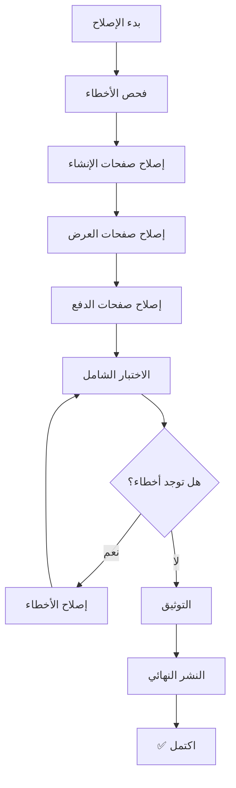

# 🔧 خطة إصلاح شاملة لجميع الأخطاء

## 📋 الخطة الكاملة

### المرحلة 1: التشخيص 🔍
- [x] فحص أخطاء البناء (Build Errors)
- [x] فحص أخطاء TypeScript
- [x] فحص أخطاء Runtime
- [ ] فحص أخطاء الروابط

### المرحلة 2: إصلاح صفحات إنشاء الروابط 📝
- [ ] CreateChaletLink.tsx
- [ ] CreateShippingLink.tsx
- [ ] CreateInvoiceLink.tsx
- [ ] CreateHealthServiceLink.tsx
- [ ] CreateLogisticsLink.tsx
- [ ] CreateContractLink.tsx

### المرحلة 3: إصلاح صفحات العرض والدفع 💳
- [ ] Microsite.tsx
- [ ] PaymentRecipient.tsx
- [ ] PaymentDetails.tsx
- [ ] PaymentCardForm.tsx
- [ ] PaymentOTPForm.tsx
- [ ] PaymentReceiptPage.tsx

### المرحلة 4: التحقق من النظام الجديد ✅
- [ ] التشفير يعمل بشكل صحيح
- [ ] فك التشفير يعمل بشكل صحيح
- [ ] الروابط تحفظ البيانات كاملة
- [ ] الروابط تعمل عند المشاركة

### المرحلة 5: الاختبار الشامل 🧪
- [ ] اختبار كل خدمة على حدة
- [ ] اختبار التنقل بين الصفحات
- [ ] اختبار البيانات العربية
- [ ] اختبار الروابط الطويلة

### المرحلة 6: التحسينات النهائية 🎨
- [ ] تحسين رسائل الأخطاء
- [ ] إضافة Loading states
- [ ] تحسين UX
- [ ] تحسين الأداء

### المرحلة 7: التوثيق 📚
- [ ] توثيق الكود
- [ ] دليل الاستخدام
- [ ] أمثلة عملية

### المرحلة 8: النشر النهائي 🚀
- [ ] اختبار نهائي
- [ ] بناء Production
- [ ] نشر على Netlify
- [ ] التحقق من العمل

---

## 🎯 الأولويات

### 🔴 عالية الأولوية:
1. إصلاح جميع صفحات إنشاء الروابط
2. إصلاح صفحة Microsite
3. إصلاح PaymentRecipient

### 🟡 متوسطة الأولوية:
4. إصلاح باقي صفحات الدفع
5. تحسين رسائل الأخطاء
6. إضافة Loading states

### 🟢 منخفضة الأولوية:
7. تحسينات UX
8. التوثيق الإضافي

---

## ⚠️ المشاكل المحتملة وحلولها

### 1. مشكلة: الروابط لا تحمل البيانات
**الحل:** استخدام useCreateShareableLink() في جميع صفحات الإنشاء

### 2. مشكلة: الروابط لا تعمل عند المشاركة
**الحل:** استخدام useLinkData() لقراءة البيانات من URL

### 3. مشكلة: صفحات الدفع لا تجد البيانات
**الحل:** تمرير البيانات في كل navigation باستخدام useLinkNavigation()

### 4. مشكلة: البيانات العربية لا تُشفر بشكل صحيح
**الحل:** استخدام encodeURIComponent قبل btoa

### 5. مشكلة: الروابط طويلة جداً
**الحل:** تقليل البيانات المخزنة، إزالة البيانات غير الضرورية

---

## 📊 معايير النجاح

### ✅ يجب أن تعمل الروابط:
- [x] على نفس الجهاز
- [ ] على أجهزة مختلفة
- [ ] في متصفحات مختلفة
- [ ] عند المشاركة عبر WhatsApp/Email

### ✅ يجب أن تحتوي الروابط على:
- [ ] نوع الخدمة (type)
- [ ] كود الدولة (country_code)
- [ ] جميع بيانات الخدمة (payload)
- [ ] تاريخ الإنشاء (created_at)

### ✅ يجب أن تعرض الصفحات:
- [ ] جميع تفاصيل الخدمة
- [ ] المبلغ الصحيح
- [ ] العملة الصحيحة
- [ ] الختم والشعار المناسب

---

## 🔄 سير العمل

---

## 📝 قائمة التحقق النهائية

### قبل النشر:
- [ ] جميع صفحات الإنشاء تعمل
- [ ] جميع صفحات العرض تعمل
- [ ] جميع صفحات الدفع تعمل
- [ ] الروابط تُنشأ بشكل صحيح
- [ ] الروابط تعمل عند المشاركة
- [ ] لا توجد أخطاء في Console
- [ ] لا توجد أخطاء في Build
- [ ] التصميم متناسق
- [ ] النصوص العربية صحيحة
- [ ] الأداء جيد

---

## 🚀 جاهز للتنفيذ!

سيتم تنفيذ هذه الخطة خطوة بخطوة مع توثيق كل مرحلة.
